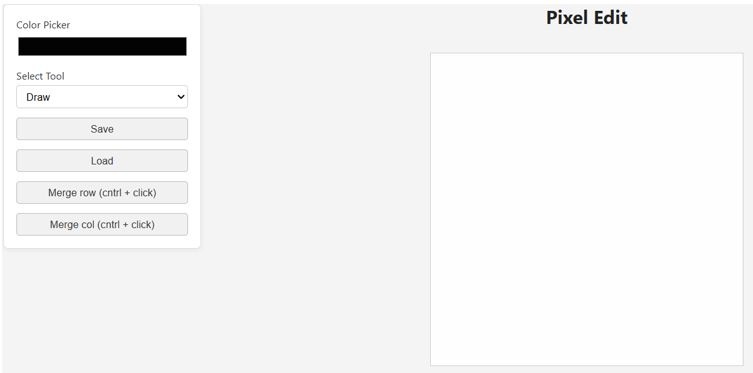

# Sprite creator

- Inspired by the sprite creator from Eloquent Javascript, figured  I'd make it my own way. For now only 400 by 400 pixel sprites can be drawn, loaded and saved. Sprite sheets can be formed by merging sprites first by row, then by column.

Pretty useful if anytime I need to make spritesheets.

Features one can add to extend it:

1. Adjustable canvas sizes according to UI.
2. Canvas size dynamically adjust when image loads.
3. Allow for merging uneven sized and asymmetrical sprite sheets by row and column.

